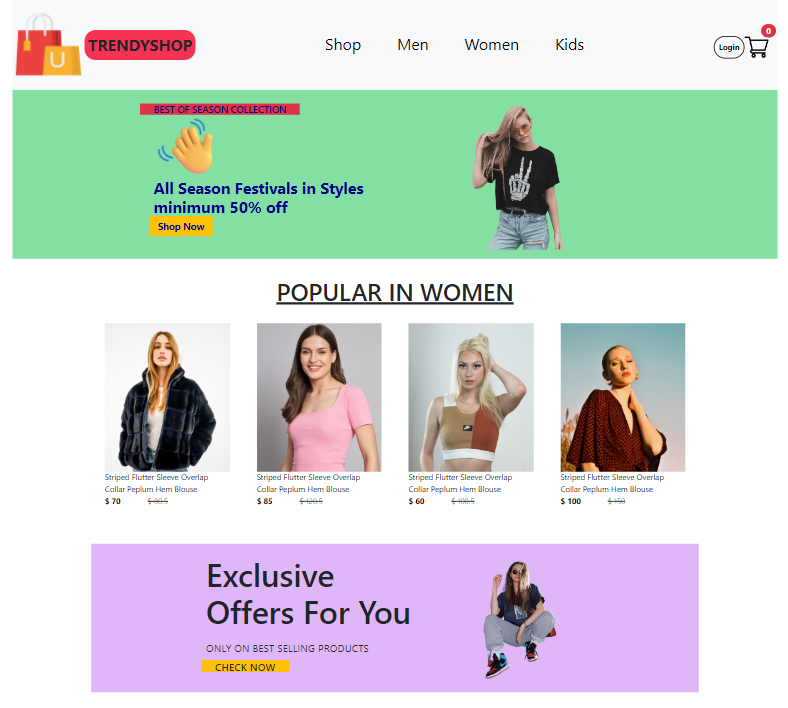

# TrendyShop E-Commerce Website [🔗](https://trendy-shop-xi.vercel.app/)




Welcome to our Fashion E-Commerce Website project! This website is designed to showcase and sell a variety of fashion products for men, women, and kids. The website is responsive, meaning it is optimized for viewing on smaller screens such as mobile devices.

## Features

- **Product Categories**: The website features products categorized into men's fashion, women's fashion, and kids' fashion.
- **Responsive Design**: The website is responsive and adapts to different screen sizes, providing an optimal viewing experience on both desktop and mobile devices.
- **Product Listings**: Users can browse through a wide range of fashion products, view product details, and add items to their cart for purchase.
- **Shopping Cart**: Users can add products to their shopping cart, review cart contents, update quantities, and proceed to checkout.

## Technologies Used

- Frontend: React.js, HTML5, CSS3, JavaScript
- UI Framework: Bootstrap
- Routing: React Router

## Setup Instructions

- Clone the repository to your local machine using

```bash
git clone https://github.com/Faesalkhan/TrendyShop
```

- Navigate to the project directory.
- Install dependencies using

```bash
npm install
```

- Start the frontend development server using

```bash
npm start
```

- Access the website in your browser at localhost.

Feel free to contribute to this project by submitting bug fixes, feature enhancements, or new ideas through pull requests.
